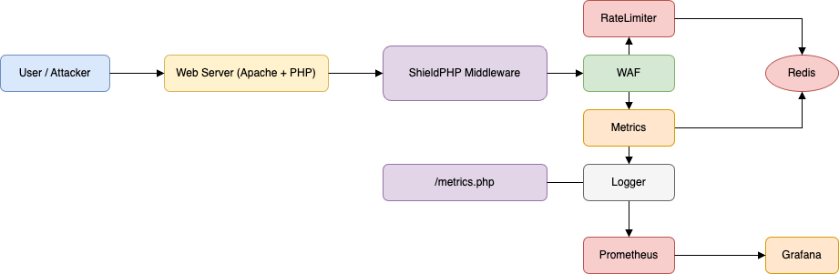
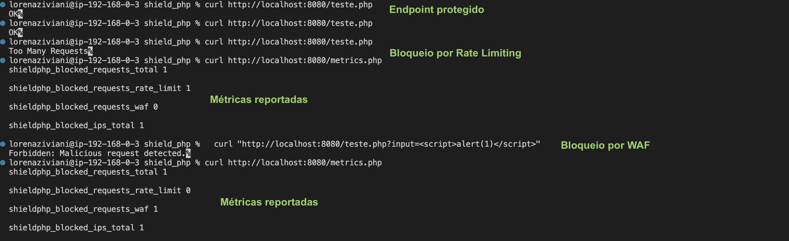
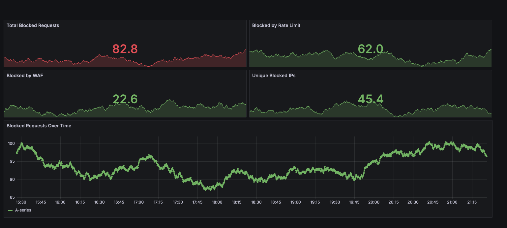

# 🛡️ ShieldPHP - Middleware de Segurança para Aplicações PHP

<div align="center">


<div data-badges>
  
  
  
</div>

<div data-badges>
  
  
  
  
</div>
</div>

O **ShieldPHP** é um middleware de segurança para aplicações PHP, com rate limiting, WAF, bloqueio de IPs, cache via Redis, observabilidade com Prometheus/Grafana, deploy automatizado com Docker Compose e arquitetura extensível.

✔️ **Rate limiting por IP e regras customizadas**

✔️ **Detecção de padrões maliciosos (XSS, SQLi, etc.)**

✔️ **Observabilidade com Prometheus e Grafana**

✔️ **Escalável, resiliente e fácil de subir (Docker Compose)**

✔️ **Testes, lint e segurança automatizados**

---

## 🖥️ Como rodar este projeto

### Requisitos:

- [PHP 8.1+](https://www.php.net/downloads.php)
- [Composer](https://getcomposer.org/)
- [Docker & Docker Compose](https://docs.docker.com/get-docker/)

### Execução rápida:

1. Clone o repositório:
   ```sh
   git clone https://github.com/lorenaziviani/shield_php.git
   cd shield_php
   composer install
   ```
2. Configure as variáveis de ambiente:
   ```sh
   cp config.example.php config.php
   # Edite config.php conforme necessário
   ```
3. Suba o ambiente completo:
   ```sh
   docker-compose up --build
   ```
4. Acesse o endpoint de métricas, Prometheus e Grafana conforme instruções abaixo.

---

## ✨ Exemplos de uso e prints

### 1. Proteção de endpoint (Rate Limiting e WAF)

```php
// Exemplo de uso do middleware
require 'src/SecurityMiddleware.php';
$middleware = new SecurityMiddleware();
$middleware->handle();
```

---

### 2. Métricas Prometheus

- Endpoint Prometheus: `http://localhost:9100/metrics` ou `http://localhost:8080/metrics`
- Dashboard Grafana: `http://localhost:3000`

---

### 3. Benchmark

```sh
chmod +x bench/ab-test.sh
./bench/ab-test.sh
```

ou

```sh
make bench
```

---

### 4. Testes, Lint e Segurança

```sh
make test
# ou
vendor/bin/phpunit

make lint
# ou
php -l src/
```

---

## 📝 Features do projeto

- 🛡️ **Rate limiting por IP e regras customizadas**
- 🔍 **Detecção de padrões maliciosos (XSS, SQLi, etc.)**
- 🚫 **Bloqueio de IPs e regras dinâmicas**
- 💾 **Cache inteligente via Redis**
- 📈 **Métricas Prometheus e dashboard Grafana**
- 🐳 **Deploy automatizado com Docker Compose**
- 🧪 **Testes unitários e integração**
- 🧹 **Lint e análise de segurança automatizados**
- 🧩 **Arquitetura modular e extensível**

---

## ⚙️ Comandos úteis

```sh
# Testes unitários
make test

# Testes de integração (WAF, métricas, rate limit, WAF malicioso)
make test-all

# Testes usando Redis local
make test-local

# Build do ambiente Docker
make build

# Subir ambiente Docker
make up

# Parar ambiente Docker
make down

# Reiniciar ambiente Docker
make restart

# Logs do container app
make logs

# Lint básico
make lint

# Code style PSR12
make phpcs

# Análise estática
make phpstan

# Corrigir code style automaticamente
make fix

# Checagem de vulnerabilidades
make security-check
```

---

## 🌐 Variáveis de Ambiente / Configuração

```php
// config.example.php
return [
    'env' => 'dev',
    'debug' => true,
    'log_file' => '/var/log/shieldphp.log',
    'rate_limit' => 100,
    'rate_limit_window' => 60,
    'redis_host' => 'redis',
    'redis_port' => 6379,
    // ... outras configs
];
```

---

## 📁 Estrutura de Pastas

```
shield_php/
  composer.json
  docker-compose.yml
  Makefile
  config.example.php
  src/
    LoggerInterface.php
    Metrics.php
    RateLimiter.php
    SecurityMiddleware.php
    SimpleFileLogger.php
    WAF.php
    WAFMiddleware.php
    WAFRuleLoader.php
  public/
    metrics.php
    teste.php
  tests/
    integration/
      MetricsRedisTest.php
      RateLimiterRedisTest.php
      WAFRedisTest.php
    RateLimiterTest.php
    WAFTest.php
  bench/
    ab-test.sh
    artillery-test.yml
  .gitassets/
    cover.png
    requests.png
    grafana.png
```

---

## 🏗️ Arquitetura do Sistema



**Fluxo resumido:**

1. O middleware intercepta as requisições HTTP e aplica as regras de segurança (rate limit, WAF, bloqueio de IPs)
2. As métricas são expostas via endpoint `/metrics` para Prometheus
3. O ambiente é facilmente escalável e observável via Docker Compose

---

## 🖼️ Exemplos Visuais dos Cenários

### 1. Requisições bloqueadas



### 2. Dashboard Grafana



---

## 💎 Links úteis

- [PHP Documentation](https://www.php.net/docs.php)
- [Prometheus](https://prometheus.io/)
- [Grafana](https://grafana.com/)
- [Docker](https://www.docker.com/)
- [OWASP Top 10](https://owasp.org/www-project-top-ten/)
